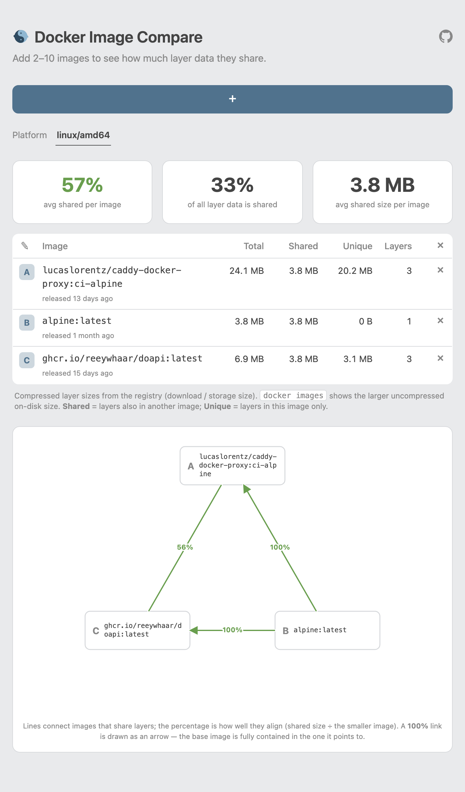

# docker-image-compare

## [https://dic.vyrtsev.com](https://dic.vyrtsev.com/?image=alpine%3Alatest&image=ghcr.io%2Freeywhaar%2Fbackio%3Alatest&platform=linux%2Famd64)

A tiny self-hosted web tool that compares **public Docker images** and shows how much
layer data they **share**.



## Why

Docker images are stacks of content-addressed layers, and a registry — or a host's disk —
stores each distinct layer only **once**. Two images built on the same base therefore cost
far less together than their individual sizes suggest: they share the base byte-for-byte.

This matters when a box is **short on storage**. On a small VDS that has to keep several
images around, the disk they actually consume is the size of the _union_ of their layers,
not the sum. So the practical question is: _which image variants should I run together to
maximize shared layers and keep the total footprint small?_ For example — are
`python:3.12-slim` and `node:20-slim` cheaper to host side-by-side than their `-bookworm`
counterparts?

This tool answers that without pulling anything: it reads the registry manifests and reports,
per image, how much is **shared** with the others versus **unique** to it — so you can pick
the combination with the most overlap.

- **Backend:** Go (standard library only — no external dependencies).
- **Frontend:** [htmx](https://htmx.org) — the server returns small HTML fragments.
- Everything ships in a single container image: `ghcr.io/reeywhaar/docker-image-compare`.

## Run locally

```sh
go run .
# open http://localhost:8080
```

Click **+** to add an image, add a second one, then pick a platform. Try:

- `nginx:latest` vs `nginx:latest` → 100% shared (sanity check).
- `node:20` vs `node:20-bookworm` → large shared base, smaller deltas.
- `nginx:nonexistent-tag` → inline error, no crash.

## Run with Docker

```sh
docker build -t ghcr.io/reeywhaar/docker-image-compare .
docker run --rm -p 8080:8080 ghcr.io/reeywhaar/docker-image-compare

# Optionally advertise this deployment's public URL in the registry User-Agent:
docker run --rm -p 8080:8080 \
  -e HOST=https://compare.example.com \
  ghcr.io/reeywhaar/docker-image-compare
```

## Configuration

| Env var | Default   | Purpose                                                                              |
| ------- | --------- | ------------------------------------------------------------------------------------ |
| `PORT`  | `8080`    | HTTP listen port.                                                                    |
| `HOST`  | _(unset)_ | Public host/URL of this deployment; embedded in the `User-Agent` sent to registries. |
| `MAX_IMAGES` | `10` | Most images comparable at once (minimum 2). |

The backend also forwards the inbound request's `X-Forwarded-For` to registries.

## Development

```sh
go test ./...   # reference parsing + shared-size math
go vet ./...
```

Project layout:

```
main.go          HTTP server, handlers, //go:embed of templates + static assets
registry.go      reference parsing, token auth, manifest/index fetch, platform resolution
compare.go       layer-set intersection + shared-size math + size formatting
templates/       index.html (page shell) + app.html (htmx fragment)
static/          htmx.js + style.css
```
